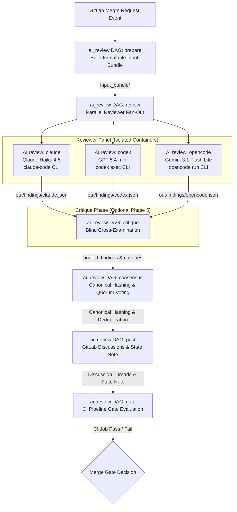

# Code Tribunal (`ai-review`)

[](.github/workflows/ci.yml) [](.github/workflows/publish-ai-review-images.yml)
[](pyproject.toml)
[](ai-review/config/review.yaml)
[](.github/workflows/publish-ai-review-images.yml)

**Code Tribunal** is an enterprise-grade, multi-agent AI code review engine designed for automated GitLab Merge Request (MR) evaluation, consensus-driven defect detection, blind cross-examination (critique), and automated merge gating.

It orchestrates a panel of independent LLM reviewer models via provider CLIs (**Claude Code**, **Codex CLI**, and **OpenCode CLI**) routed through OpenRouter, aggregates structured findings via a deterministic consensus engine, performs optional blind cross-examination, posts idempotent inline GitLab discussions, maintains state across MR revisions, and enforces CI/CD merge gating.

---

## Key Features

- **Multi-Agent Consensus Panel**: Combines independent model reviewers (**Anthropic Claude Haiku 4.5**, **OpenAI GPT-5.4-mini**, and **Google Gemini 3.1 Flash Lite**) to eliminate single-model hallucination and bias.
- **Blind Cross-Examination (Critique Phase)**: Reviewers evaluate anonymized findings from peers without knowing author identities, emitting auditable agreements (`agree`), disputes (`dispute`), noise classifications (`noise`), or duplicate markers (`duplicate`) before final consensus.
- **Deterministic Consensus Engine**: Normalizes line anchors, computes canonical context hashes (`anchor_context_hash`, `body_hash`), applies quorum voting logic, and enforces panel degradation rules.
- **Zero-Trust Security & Container Isolation**: Reviewer containers run in read-only repository sandboxes with CLI-policy-dependent provider access (runner/container egress enforcement is planned), no shell execution capabilities, and zero access to GitLab API tokens or host environment variables.
- **Idempotent Discussion Upserting**: Posts and updates inline diff discussions on GitLab MRs without creating duplicate threads across commits.
- **State Note Persistence & Anchor Drift Recovery**: Stores machine-owned state payloads as hidden base64url-encoded GitLab MR notes (`ai-review-state:v1`), mapping historical issues across code revisions using line remapping (`anchors.py`).
- **Automated Merge Gating**: Integrates natively with GitLab CI/CD `pipelines_must_succeed` setting, automatically failing the pipeline when unresolved blocking findings exist.

---

## High-Level System Architecture

Code Tribunal enforces a strict zero-trust boundary. Reviewers execute inside pre-built Docker containers (`$AI_REVIEW_REVIEWER_IMAGE`) with read-only repository snapshots, CLI-policy-dependent provider access, and no GitLab credential access.



---

## Single-Stage CI DAG Execution Lifecycle

The pipeline uses one `ai_review` stage with six logical phases ordered by
`needs`. This keeps consumer pipelines compact without sacrificing artifact or
failure dependencies. The same DAG can run directly or in a mirrored child
pipeline.

### 1. `prepare` (Input Bundle Packaging)
- Executed by `python -m ai_review.input_bundle prepare`.
- Extracts changed files and git diffs between source and target branches.
- Fetches historical state from the MR's hidden state note (`ai-review-state:v1`).
- Constructs an immutable `inputs/` directory containing:
  - `repo_snapshot/`: Read-only code tree.
  - `manifest.json`: Commit SHAs, project/MR IDs, target branch metadata.
  - `state_aliases.json`: Historical issue context hashes and discussion IDs.
  - `config.review.yaml`: Active runtime configuration.

### 2. `review` (Parallel Reviewer Fan-Out)
- Executes `AI review: [claude]`, `AI review: [codex]`, and `AI review: [opencode]` in parallel (`allow_failure: true`). The bracket suffixes preserve reviewer identity while allowing GitLab's regular pipeline graph to collapse the jobs into one group.
- Each reviewer job runs inside `$AI_REVIEW_REVIEWER_IMAGE` executing wrapper scripts ([ai-review/adapters/run_reviewer.sh](ai-review/adapters/run_reviewer.sh)).
- Output findings are strictly validated against [ai-review/schemas/finding_batch.schema.json](ai-review/schemas/finding_batch.schema.json).
- Status reports are saved to `out/status/<reviewer>.json`.

### 3. `critique` (Blind Cross-Examination - Optional)
- Active when `critique.enabled: true` (and `critique.rounds: 1`). The GitLab template uses `AI_REVIEW_CRITIQUE_ENABLED` for both job creation and runtime config. The GitHub template always creates the critique matrix so artifact dependencies remain stable; when disabled, each runner emits a skipped artifact without calling a model.
- Pools findings from all successful reviewers into anonymized batches (`reviewer_A`, `reviewer_B`) stripped of reviewer identities.
- Reviewers evaluate peer findings, producing agreement (`agree`), dispute (`dispute`), noise (`noise`), or duplicate (`duplicate`) verdicts against [ai-review/schemas/critique_batch.schema.json](ai-review/schemas/critique_batch.schema.json).

### 4. `consensus` (Deduplication & Quorum Voting)
- Executed by `python -m ai_review.consensus`.
- Reads all finding batches and critique reports.
- Normalizes file paths and line anchors.
- Computes canonical `anchor_context_hash` (path + line content) and `body_hash` (title + description) via `canonical.py`.
- Groups findings describing the same defect across reviewers.
- Evaluates the **Panel Degradation Matrix** and quorum rules to determine:
  - `surfaced_findings`: Findings that passed quorum/policy checks.
  - `fyi_findings`: Non-blocking informational items.
  - `block_merge`: Boolean indicating whether merge must be blocked.
- Outputs `out/consensus/consensus.json` conforming to [ai-review/schemas/consensus.schema.json](ai-review/schemas/consensus.schema.json).
- For a full walkthrough of the "LLMs propose, deterministic Python decides" model — how differently-shaped reviewer output is normalized and how the vote/severity/critique logic reaches a reproducible decision — see [ai-review/CONSENSUS.md](ai-review/CONSENSUS.md).

### 5. `post` (Idempotent Upsert & State Persistence)
- Executed by `python -m ai_review.post`.
- Acquires GitLab resource lock (`ai-review-mr-${CI_PROJECT_ID}-${CI_MERGE_REQUEST_IID}`).
- Matches consensus findings against prior state records using line remapping (`anchors.py` and `memory.py`).
- Upserts inline diff discussions via GitLab API (`gitlab_client.py`):
  - Creates new discussions for new findings.
  - Skips unchanged existing discussions (`skipped_unchanged`).
  - Updates discussion text if body content changed.
- Posts or updates a summary comment for multiline/fallback findings.
- Writes an updated hidden state note (`ai-review-state:v1`) containing base64url-encoded state payload with SHA-256 integrity checksum.
- Outputs `out/post/post_result.json` matching [ai-review/schemas/post_result.schema.json](ai-review/schemas/post_result.schema.json).

### 6. `gate` (CI Pipeline Gate Enforcement)
- Executed by `python -m ai_review.gate`.
- Reads `consensus.json` and `post_result.json`.
- Enforces merge policy: if `block_merge: true` and active blocking findings exist, exits with non-zero exit code (`1`), blocking the MR pipeline.
- Handles stale HEAD safety (`pass_noop` when pipeline HEAD no longer matches current MR HEAD).
- Outputs `out/gate/gate_result.json` matching [ai-review/schemas/gate_result.schema.json](ai-review/schemas/gate_result.schema.json).

---

## Active configuration surface

The shipped [runtime configuration](ai-review/config/review.yaml) contains only controls consumed by production code. Future or paused controls are intentionally absent rather than exposed as reserved placeholders.

## Security Model & Container Isolation

Code Tribunal isolates model reviewers to protect codebase confidentiality and prevent prompt injection exploits:

```
+-----------------------------------------------------------------------------------+
|                            GitLab CI Runner Host                                  |
|                                                                                   |
|  +-------------------------------------+   +-----------------------------------+  |
|  |   Trusted Host Job (prepare/post)   |   |  Reviewer Container (review_*)    |  |
|  |                                     |   |                                   |  |
|  | - Access to GITLAB_WRITE_TOKEN      |   | - Isolated Read-Only /opt/ai-review|  |
|  | - Full git access                   |   | - ONLY OPENROUTER_API_KEY exposed |  |
|  | - Posts Discussions & State Notes   |   | - Provider access: CLI-policy dependent |  |
|  +-------------------------------------+   | - Shell & File Edits DENIED       |  |
|                                            +-----------------------------------+  |
+-----------------------------------------------------------------------------------+
```

- **Trusted Root (`/opt/ai-review`)**: Reviewer CLIs and Python runtime execute code strictly from `/opt/ai-review` inside pre-built Docker images, isolated from MR-controlled code.
- **Credential Separation**: Reviewer containers receive only `OPENROUTER_API_KEY` (or `ANTHROPIC_BASE_URL` mapping) and have **no access** to GitLab write tokens or local host permissions.
- **CLI Hardening**:
  - **Claude Code**: Invoked via `claude.sh` with stream output parsing and disabled legacy model remap.
  - **Codex CLI**: Executed via `codex.sh` with `codex exec --ephemeral --ignore-user-config --ignore-rules --sandbox read-only`.
  - **OpenCode CLI**: Invoked via `opencode.sh` with `opencode --pure run --agent ai-reviewer --format json` in an isolated directory with `OPENCODE_DISABLE_AUTOUPDATE=1`, `OPENCODE_DISABLE_DEFAULT_PLUGINS=1`, and `OPENCODE_DISABLE_LSP_DOWNLOAD=1`.
- **Egress Control**: Provider endpoint pinning is enforced in adapter validation, but runner/container network egress is CLI-policy-dependent and not yet enforced at the container layer (tracked by H2/SPEC-06).
- **Immutable Container Images**: Pre-built base and reviewer container images are preflighted and signed/attested via GitHub Actions.

---

## Schemas & Canonical Data Structures

All inter-stage data exchanges are governed by 9 JSON Schemas located in [ai-review/schemas/](ai-review/schemas):

| Schema File | Schema Version ID | Description |
|---|---|---|
| [finding_batch.schema.json](ai-review/schemas/finding_batch.schema.json) | `finding_batch.v1` | Reviewer finding output (category, severity, line numbers, anchor code, title, body, confidence, suggested_fix). |
| [raw_finding_batch.schema.json](ai-review/schemas/raw_finding_batch.schema.json) | N/A | Intermediate schema used for CLI structured output validation (e.g. Codex CLI `--output-schema`). |
| [critique_batch.schema.json](ai-review/schemas/critique_batch.schema.json) | `critique_batch.v1` | Peer cross-examination verdicts (`agree`, `dispute`, `noise`, `duplicate`). |
| [consensus.schema.json](ai-review/schemas/consensus.schema.json) | `consensus.v1` | Deduplicated findings, vote tallies, surfaced/FYI classification, and `block_merge` decision. |
| [state.schema.json](ai-review/schemas/state.schema.json) | `state.v1` | Hidden state payload tracking active/resolved/wontfix/superseded issues across MR commits. |
| [state_aliases.schema.json](ai-review/schemas/state_aliases.schema.json) | `state_aliases.v1` | State alias records passed to `prepare` for historical issue matching across commits. |
| [adapter_status.schema.json](ai-review/schemas/adapter_status.schema.json) | `adapter_status.v1` | Execution summary per reviewer (`success`, `model_error`, `schema_error`, `timeout`, `skipped`). |
| [post_result.schema.json](ai-review/schemas/post_result.schema.json) | `post_result.v1` | Details of created, updated, skipped, or resolved GitLab MR discussion threads and summary note writes. |
| [gate_result.schema.json](ai-review/schemas/gate_result.schema.json) | `gate_result.v1` | Merge gate verdict (`passed`, `failed_blocking_findings`, `stale_head_pass`). |

### Normalization & Hashing
- **Canonical JSON (`canonical.py`)**: Key sorting, 2-space indentation or compact formatting without trailing whitespace.
- **Context Hash (`anchor_context_hash`)**: `SHA-256(normalized_relative_path + "\n" + normalized_anchor_snippet)`
- **Body Hash (`body_hash`)**: `SHA-256(normalized_title + "\n" + normalized_body)`

---

## Local Development & Harness

Code Tribunal includes a comprehensive local harness for offline testing, schema validation, and adapter debugging without requiring live API keys.

### Makefile Commands

```bash
# Run unit & integration test suite across ai-review/tests
make test

# Run ruff linter & python compileall verification
make lint

# Run local mock reviewer fan-out using test fixtures (AI_REVIEW_LOCAL_MOCK=1)
make review-local

# Run consensus calculation against mock findings
make consensus-local

# Validate output artifacts against JSON schemas
make validate-local
```

### Local Execution Examples

1. **Run Local Mock Fan-Out**:
   ```bash
   make review-local REVIEWER=claude \
     DIFF=ai-review/tests/fixtures/diffs/simple.diff \
     REPO=ai-review/tests/fixtures/repos/simple
   ```

2. **Run Against Live OpenRouter API**:
   ```bash
   AI_REVIEW_REQUIRE_REAL_OPENROUTER=1 \
   OPENROUTER_API_KEY=sk-or-v1-... \
   OPENROUTER_BASE_URL=https://openrouter.ai/api/v1 \
     make review-local REVIEWER=codex
   ```

---

## GitLab CI Integration Guide & Image Pinning

To integrate Code Tribunal into downstream projects:

> **Unreleased compatibility note:** the grouped job names replace
> `review_<reviewer>` and `critique_<reviewer>`. Consumers with custom `needs`,
> overrides, dashboards, or scripts that reference those identifiers must move
> to `AI review: [reviewer]` and `AI critique: [reviewer]` before adopting this
> template revision.

| Previous job | Grouped job |
|---|---|
| `review_claude` | `AI review: [claude]` |
| `review_codex` | `AI review: [codex]` |
| `review_opencode` | `AI review: [opencode]` |
| `critique_claude` | `AI critique: [claude]` |
| `critique_codex` | `AI critique: [codex]` |
| `critique_opencode` | `AI critique: [opencode]` |

1. **Choose direct or child-pipeline integration from a trusted template project.**

   Direct mode adds one stage to the consumer pipeline:

   ```yaml
   stages:
     # ... existing stages
     - ai_review
     # ... later stages such as deploy

   include:
     - project: 'org/code-tribunal-ci'
       ref: '<40-character-template-commit-sha>'
       file: '/ai-review/ci/review.gitlab-ci.yml'
   ```

   Child-pipeline mode keeps the parent graph to one mirrored bridge job. The
   bridge starts immediately, while later stages still wait for the child gate:

   ```yaml
   stages:
     # ... existing stages
     - ai_review
     # ... later stages such as deploy

   ai_review:
     stage: ai_review
     needs: []
     inherit:
       variables: false
     rules:
       - if: '$CI_PIPELINE_SOURCE == "merge_request_event"'
       - if: '$CI_PIPELINE_SOURCE == "web"'
       - if: '$CI_PIPELINE_SOURCE == "api"'
     trigger:
       include:
         - project: 'org/code-tribunal-ci'
           ref: '<40-character-template-commit-sha>'
           file: '/ai-review/ci/review-child.gitlab-ci.yml'
         - project: 'org/code-tribunal-ci'
           ref: '<same-40-character-template-commit-sha>'
           file: '/ai-review/ci/review.gitlab-ci.yml'
       strategy: mirror
       forward:
         yaml_variables: false
         pipeline_variables: false
   ```

   **Child mode must use exactly those two project includes.** Do not add string,
   local, remote, component, template, duplicate, or third project entries to
   `trigger:include`. Host the templates in a separate protected project,
   require CODEOWNERS approval, and pin both files to the same reviewed full
   commit SHA.

   The bridge must not define `variables`, and both forwarding flags must remain
   explicitly disabled. Forwarded values become high-precedence downstream
   pipeline variables and could otherwise replace trusted image, configuration,
   endpoint, or mock-mode settings. Root variables for unrelated parent jobs are
   safe only because `inherit:variables: false` and the two forwarding guards
   isolate them from the child.

   Direct mode shares the parent pipeline's configuration namespace. Other
   top-level or transitive includes can redefine jobs after a local audit, so
   use child mode for the strongest isolation. If direct mode is required,
   protect the root CI configuration and every included source with approval or
   a GitLab pipeline execution policy.

2. **Image Variables & Cutover State**:
   `ai-review/ci/review.gitlab-ci.yml` now pins the public GHCR images published and verified in [ai-review/PHASE_5_5_ACCEPTANCE.md](ai-review/PHASE_5_5_ACCEPTANCE.md) — the private bootstrap refs have been cut over:
   ```yaml
   variables:
     AI_REVIEW_BASE_IMAGE: "ghcr.io/seanleecoder/code-tribunal/ai-review-base:1.0-b79f29f69d053f87f1a205a82cefe0f3e1b93bef@sha256:d2a3fc87ac97aa9278a66669670e06d59b6bb5ae9db695836873b5f42892c7b0"
     AI_REVIEW_REVIEWER_IMAGE: "ghcr.io/seanleecoder/code-tribunal/ai-review-reviewer:1.0-b79f29f69d053f87f1a205a82cefe0f3e1b93bef@sha256:a6c112245c35e02a6f42001e5bf88578eabfd160a66a4e1e9552cba477e2478d"
     AI_REVIEW_TRUSTED_IMAGE_SHA: "b79f29f69d053f87f1a205a82cefe0f3e1b93bef"
   ```
   **GHCR Cutover Procedure**: When [.github/workflows/publish-ai-review-images.yml](.github/workflows/publish-ai-review-images.yml) runs on `main` and publishes a newer commit, update these 3 variables together in `ai-review/ci/review.gitlab-ci.yml` to use the new immutable GHCR `@sha256:` digest refs provided in the workflow summary:
   ```yaml
   variables:
     AI_REVIEW_BASE_IMAGE: "ghcr.io/seanleecoder/code-tribunal/ai-review-base:1.0-<sha>@sha256:<digest>"
     AI_REVIEW_REVIEWER_IMAGE: "ghcr.io/seanleecoder/code-tribunal/ai-review-reviewer:1.0-<sha>@sha256:<digest>"
     AI_REVIEW_TRUSTED_IMAGE_SHA: "<sha>"
   ```

3. **Configure GitLab CI/CD Variables** (Settings -> CI/CD -> Variables):

| Variable | Description | Masked | Protected | Required |
|---|---|---|---|---|
| `OPENROUTER_API_KEY` | OpenRouter API Key for Claude, Codex, & OpenCode reviewers. | Yes | Yes | Yes |
| `GITLAB_READ_TOKEN` | Project access token with `read_api` scope. | Yes | Yes | Yes |
| `GITLAB_WRITE_TOKEN` | Project access token with `api` scope for discussion posting. | Yes | Yes | Yes |

Protected variables are intentionally withheld from unprotected fork/MR branches. If an external fork pipeline needs advisory-only review, do not expose the secret-bearing template or tokens to that pipeline. Maintainers can audit a consumer CI file before rollout:

```bash
PYTHONPATH=ai-review/src python scripts/verify_pipeline_trust.py \
  path/to/.gitlab-ci.yml \
  --mode child \
  --template-project org/code-tribunal-ci \
  --template-sha <40-character-template-commit-sha>
```

Use `--mode direct` for direct integration. Supply the expected project and SHA
from protected deployment configuration, not from merge-request-controlled CI
variables. The auditor validates the local composition; it does not inspect the
expanded contents of unrelated or transitive includes.


### Upgrade note: render body hash v1

This release folds `RENDER_BODY_VERSION` into AI review discussion `body_hash` values. The posted Markdown body is intentionally unchanged, but existing `ai-review:v1` markers from older builds will not match the new hash input. Operators should expect a one-time update of existing bot-authored AI review threads on the next run after upgrading.

4. **Required GitLab Project Settings**:
   - Enable **Pipelines must succeed** (Settings -> General -> Merge requests).
   - Ensure Merge Request Pipelines are enabled (`rules: if: '$CI_PIPELINE_SOURCE == "merge_request_event"'`).
   - By default the review flow **auto-runs** on every merge request. To require a human to start it instead, set `AI_REVIEW_MANUAL="true"` (see below) — note that with a non-blocking manual trigger, an un-started review leaves the MR mergeable, so "Pipelines must succeed" only enforces the gate once a review has been triggered.

### Runtime Environment Overrides

The reviewer models and most operational toggles live in the image-baked
[`config/review.yaml`](ai-review/config/review.yaml), but the following can be
changed **at runtime via project/pipeline CI/CD variables without rebuilding the
image**. Set them as project-level variables so every job in the pipeline sees a
consistent view (the values are read when the config is loaded, and are recorded
under `effective_config` in `inputs/manifest.json` for audit).

| Variable | Overrides | Notes |
|---|---|---|
| `AI_REVIEW_CLAUDE_MODEL` | `reviewers.claude.model` | Any provider model id; no rebuild needed. Must match `[A-Za-z0-9._:/-]` (covers OpenRouter `:free`/`:nitro` variants); other characters are rejected as a `model_error`. |
| `AI_REVIEW_CODEX_MODEL` | `reviewers.codex.model` | Model pin relaxed (same charset as above); the OpenRouter endpoint stays fixed. |
| `AI_REVIEW_OPENCODE_MODEL` | `reviewers.opencode.model` | Model pin relaxed (same charset as above); the OpenRouter endpoint stays fixed. |
| `AI_REVIEW_<REVIEWER>_ENABLED` | `reviewers.<name>.enabled` | Strict `true`/`false`. Disabling below `panel.min_successful_reviewers_for_blocking` fails validation loudly. |
| `AI_REVIEW_<REVIEWER>_EFFORT` | `reviewers.<name>.effort` | Reasoning/exploration effort, one of `low`/`medium`/`high`/`xhigh`/`max` (anything else fails config validation). Voluntary stopping, not a turn cap. Currently consumed only by the claude adapter (`--effort`). |
| `AI_REVIEW_CRITIQUE_ENABLED` | `critique.enabled`; GitLab critique job creation | The GitLab template gates job creation on this value. The GitHub template always creates the matrix and emits skipped artifacts without model calls when set to `false`. |
| `AI_REVIEW_MERGE_GATE_ENABLED` | `merge_gate.enabled` | Run in advisory (non-blocking) mode without a rebuild. |
| `AI_REVIEW_POSTING_MODE` | `posting.mode` | Select `gitlab_discussions` or `github_reviews`; set consistently in every job. |
| `AI_REVIEW_STATE_BACKEND` | `state.backend` | Select the matching state backend; GitHub workflows use `github_pr_comment`. |
| `AI_REVIEW_GITHUB_BOT_LOGIN` | GitHub state-author lookup | Set to the bot account that owns Code Tribunal comments. The installed Actions workflow uses `github-actions[bot]` because its installation token cannot call the user-token `/user` endpoint. |
| `AI_REVIEW_PANEL_GROUPING_SEMANTIC_ENABLED` | `panel.grouping.semantic.enabled` | Strict `true`/`false`. Enables deterministic title/body similarity grouping; keep disabled until calibrated on the labeled corpus. |
| `AI_REVIEW_PANEL_GROUPING_SEMANTIC_THRESHOLD` | `panel.grouping.semantic.threshold` | Floating-point Jaccard threshold from `0.0` to `1.0`; validated at config load. |
| `AI_REVIEW_MANUAL` | Trigger mode for `prepare_ai_review` | `"true"` = non-blocking manual trigger on MRs; unset = auto-run. |

All boolean variables above must be **exactly `true` or `false`** (lowercase, no
surrounding whitespace) — a byte-for-byte match of GitLab's `== "true"` rule. Any
other value (`TRUE`, `1`, `yes`, `" true "`, a typo like `flase`) fails the pipeline
loudly rather than silently no-op'ing.

Golden consensus snapshots can be refreshed after intentional reducer output
changes with `make update-golden`; review the resulting fixture diff before merging.

> **Notes:**
> - These variables are read at runtime, but the *code that reads them* ships inside
>   the container image. A given image build must already contain this logic; after
>   that, changing the values above needs no further rebuild. Deeper policy
>   (`panel.quorum`, `severity_policy`) intentionally stays in the
>   version-pinned `review.yaml` — override the whole file via `AI_REVIEW_CONFIG` if
>   you need to change it.
> - Set these as **project-level** CI/CD variables so every job in the pipeline sees
>   the same value. The prepare stage records the effective config into
>   `inputs/manifest.json`, and the consensus stage re-derives it and **warns** if its
>   own view disagrees — a signal that a variable was scoped to only some jobs.
> - Child mode deliberately does not accept YAML, manual, scheduled, API, or
>   trigger pipeline variables from its parent. Configure approved runtime
>   options as protected project/group variables in GitLab settings. Introduce
>   typed child-pipeline inputs for any future per-run option; do not re-enable
>   general forwarding.

---

## Container Image Publishing Workflow

Container images are automatically built, preflighted, and published to GitHub Container Registry (GHCR) by [.github/workflows/publish-ai-review-images.yml](.github/workflows/publish-ai-review-images.yml):

- **Base Image**: `ghcr.io/seanleecoder/code-tribunal/ai-review-base:1.0-<commit-sha>`
- **Reviewer Image**: `ghcr.io/seanleecoder/code-tribunal/ai-review-reviewer:1.0-<commit-sha>`

### Preflight Verification & Attestations
Before publishing to GHCR, the workflow verifies:
1. Pinned CLI binaries (`claude --version`, `codex --version`, `opencode --version`).
2. Local mock fan-out and consensus calculation.
3. Cryptographic attestation signatures using GitHub Artifact Attestations (`actions/attest`).

---

## Development Milestone Acceptance History

The system was implemented and validated across 6 milestone phases:

| Phase | Milestone | Scope & Acceptance Evidence | Status |
|---|---|---|---|
| **Phase 1** | Local Harness & Schema Validation | Local harness setup, schema validation, Claude Code CLI smoke test ([ai-review/PHASE_1_ACCEPTANCE.md](ai-review/PHASE_1_ACCEPTANCE.md)). | Accepted |
| **Phase 2** | CLI Reviewers via OpenRouter | Parallel fan-out (`claude`, `codex`, `opencode`) via OpenRouter ([ai-review/PHASE_2_ACCEPTANCE.md](ai-review/PHASE_2_ACCEPTANCE.md)). | Accepted |
| **Phase 3** | Consensus & GitLab State Upsert | Quorum engine, idempotent MR discussion upsert, and merge gating ([ai-review/PHASE_3_ACCEPTANCE.md](ai-review/PHASE_3_ACCEPTANCE.md)). | Accepted |
| **Phase 4** | Anchor Drift & Revision Matching | State notes (`ai-review-state:v1`), canonical hashing, and line remapping ([ai-review/PHASE_4_ACCEPTANCE.md](ai-review/PHASE_4_ACCEPTANCE.md)). | Accepted |
| **Phase 5** | Blind Cross-Examination (Critique) | Anonymized peer critique phase, pool generation, and verdict aggregation ([ai-review/PHASE_5_ACCEPTANCE.md](ai-review/PHASE_5_ACCEPTANCE.md)). Critique now ships permanently enabled in the trusted config; see the worked example below. | Accepted |
| **Phase 5.5** | Public GHCR Container Publishing | Multi-stage image build, preflight verification, and GHCR publishing ([ai-review/PHASE_5_5_ACCEPTANCE.md](ai-review/PHASE_5_5_ACCEPTANCE.md)). Public publish, attestation, anonymous pull-by-digest, and the GitLab CI cutover to the published digests are all verified. | Accepted |

---

## Worked Example

[ai-review/EXAMPLE_PIPELINE_WALKTHROUGH.md](ai-review/EXAMPLE_PIPELINE_WALKTHROUGH.md) walks through one complete real GitLab CI pipeline run stage by stage — the exact findings each of the three reviewers emitted, how blind cross-examination scored each other's findings, how the consensus engine grouped and voted on them (including a non-obvious rule where a group's own contributing reviewers are excluded from its critique tally), and why the merge gate failed. Useful as a concrete reference for what actually flows through `out/findings/`, `out/critiques/`, and `out/consensus/consensus.json` on a real run.

---

## Repository Layout

```
code-tribunal/
├── README.md                                  # Main repository documentation
├── pyproject.toml                             # Python packaging & tool configuration
├── Makefile                                   # Local development & testing targets
├── .github/
│   └── workflows/
│       └── publish-ai-review-images.yml       # GHCR image build, preflight, & attestation workflow
├── docs/
│   ├── improvement-specs/                    # Completed specs and reconciliation audit
│   └── archived-improvement-plans/           # Paused and superseded plans
└── ai-review/
    ├── README.md                              # Subsystem sitemap & operational guide
    ├── PHASE_1_ACCEPTANCE.md                  # Phase 1 acceptance record
    ├── PHASE_2_ACCEPTANCE.md                  # Phase 2 acceptance record
    ├── PHASE_3_ACCEPTANCE.md                  # Phase 3 acceptance record
    ├── PHASE_4_ACCEPTANCE.md                  # Phase 4 acceptance record
    ├── PHASE_5_ACCEPTANCE.md                  # Phase 5 acceptance record
    ├── PHASE_5_5_ACCEPTANCE.md                # Phase 5.5 acceptance record
    ├── EXAMPLE_PIPELINE_WALKTHROUGH.md        # Worked example: one real pipeline run, stage by stage
    ├── adapters/                              # Shell wrappers for model CLI tools
    │   ├── run_reviewer.sh                    # Reviewer execution dispatcher & env isolation
    │   ├── claude.sh                          # Claude Code CLI wrapper script
    │   ├── codex.sh                           # Codex CLI wrapper script
    │   └── opencode.sh                        # OpenCode CLI wrapper script
    ├── ci/                                    # GitLab CI pipeline definitions
    │   ├── review.gitlab-ci.yml               # Production 6-stage review pipeline template
    │   └── build-images.gitlab-ci.yml         # Internal container image build pipeline
    ├── config/
    │   └── review.yaml                        # Core system configuration (panel, quorum, limits)
    ├── images/                                # Dockerfiles for base & reviewer images
    │   ├── base.Dockerfile
    │   └── reviewer.Dockerfile
    ├── prompts/                               # Markdown prompt templates
    │   ├── review.md                          # Main review prompt template
    │   ├── critique.md                        # Blind cross-examination critique prompt template
    │   └── respond.md                         # Author response evaluation prompt template
    ├── rules/                                 # Custom review rules
    │   └── README.md                          # Default review rule guidelines
    ├── schemas/                               # JSON Schemas (9 schema files)
    │   ├── adapter_status.schema.json
    │   ├── consensus.schema.json
    │   ├── critique_batch.schema.json
    │   ├── finding_batch.schema.json
    │   ├── gate_result.schema.json
    │   ├── post_result.schema.json
    │   ├── raw_finding_batch.schema.json
    │   ├── state.schema.json
    │   └── state_aliases.schema.json
    └── src/
        └── ai_review/                         # Core Python engine package (19 modules)
            ├── __init__.py
            ├── adapter_runner.py              # Runner subprocess dispatch, timeout & log redaction
            ├── anchors.py                     # Diff line parsing & fuzzy anchor drift remapping
            ├── canonical.py                   # Canonical JSON formatting & SHA-256 context hashing
            ├── config.py                      # Config loader (review_config.v1) & default merger
            ├── consensus.py                   # Deduplication, quorum voting, panel degradation logic
            ├── gate.py                        # CI merge gate evaluator
            ├── gitlab_client.py               # GitLab API client (discussions, notes, DiffNotes)
            ├── input_bundle.py                # Diff extraction & input bundle packager
            ├── memory.py                      # Historical state matching & record reconciliation
            ├── mock_reviewer.py               # Deterministic mock reviewer for offline testing
            ├── openrouter_reviewer.py         # OpenRouter direct Chat Completions client
            ├── post.py                        # Discussion upsert engine & state note writer
            ├── prompt_render.py               # Prompt renderer for review, critique, & respond
            ├── redact.py                      # Secret & token redaction engine
            ├── schema.py                      # jsonschema validator wrapper
            └── trigger.py                     # Pipeline trigger evaluator helper
```

For completed requirements and implementation gaps, see the [improvement-spec completion audit](docs/improvement-specs/completion-audit.md).
