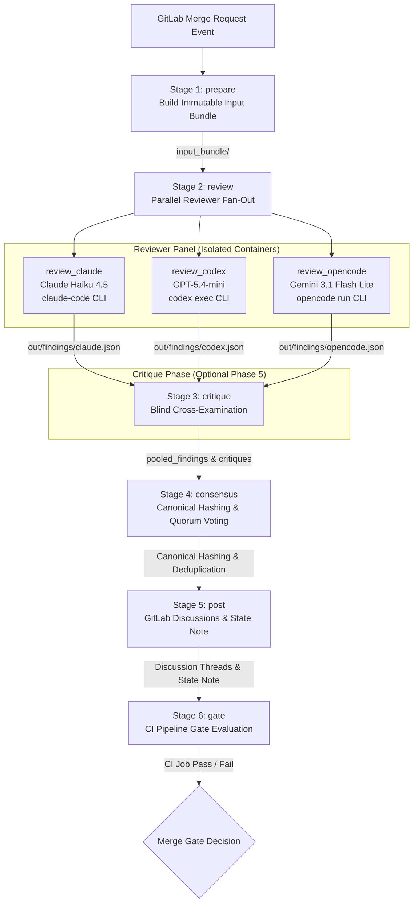

# Code Tribunal (`ai-review`)

[](.github/workflows/publish-ai-review-images.yml)
[](pyproject.toml)
[](ai-review/config/review.yaml)
[](.github/workflows/publish-ai-review-images.yml)

**Code Tribunal** is an enterprise-grade, multi-agent AI code review engine designed for automated GitLab Merge Request (MR) evaluation, consensus-driven defect detection, blind cross-examination (critique), optional Jira issue linking, and automated merge gating.

It orchestrates a panel of independent LLM reviewer models via provider CLIs (**Claude Code**, **Codex CLI**, and **OpenCode CLI**) routed through OpenRouter, aggregates structured findings via a deterministic consensus engine, performs optional blind cross-examination, posts idempotent inline GitLab discussions, maintains state across MR revisions, and enforces CI/CD merge gating.

---

## Key Features

- **Multi-Agent Consensus Panel**: Combines independent model reviewers (**Anthropic Claude Haiku 4.5**, **OpenAI GPT-5.4-mini**, and **Google Gemini 3.1 Flash Lite**) to eliminate single-model hallucination and bias.
- **Blind Cross-Examination (Critique Phase)**: Reviewers evaluate anonymized findings from peers without knowing author identities, emitting auditable agreements (`agree`), rebuttals (`disagree`), duplicate markers (`duplicate`), or unverifiable flags (`unverifiable`) before final consensus.
- **Deterministic Consensus Engine**: Normalizes line anchors, computes canonical context hashes (`anchor_context_hash`, `body_hash`), applies quorum voting logic, and enforces panel degradation rules.
- **Zero-Trust Security & Container Isolation**: Reviewer containers run in read-only repository sandboxes with restricted network egress (provider API endpoints only), no shell execution capabilities, and zero access to GitLab API tokens or host environment variables.
- **Idempotent Discussion Upserting**: Posts and updates inline diff discussions on GitLab MRs without creating duplicate threads across commits.
- **State Note Persistence & Anchor Drift Recovery**: Stores machine-owned state payloads as hidden base64url-encoded GitLab MR notes (`ai-review-state:v1`), mapping historical issues across code revisions using line remapping (`anchors.py`).
- **Jira Integration**: Discovers Jira issue keys via regex patterns (`issue_key_patterns`), formats ADF (Atlassian Document Format) summaries, and supports idempotent Jira commenting (`ai-review-jira:v1`).
- **Automated Merge Gating**: Integrates natively with GitLab CI/CD `pipelines_must_succeed` setting, automatically failing the pipeline when unresolved blocking findings exist.
- **Budget & Limit Controls**: Configurable per-job, per-MR, and per-project daily USD budget caps with automatic fallback to advisory mode.

---

## High-Level System Architecture

Code Tribunal enforces a strict zero-trust boundary. Reviewers execute inside pre-built Docker containers (`$AI_REVIEW_REVIEWER_IMAGE`) with read-only repository snapshots, restricted egress, and no credential access.



---

## 6-Stage CI Pipeline Execution Lifecycle

The pipeline executes sequentially across 6 distinct stages defined in [ai-review/ci/review.gitlab-ci.yml](ai-review/ci/review.gitlab-ci.yml):

### 1. `prepare` (Input Bundle Packaging)
- Executed by `python -m ai_review.input_bundle prepare`.
- Extracts changed files and git diffs between source and target branches.
- Fetches historical state from the MR's hidden state note (`ai-review-state:v1`).
- Constructs an immutable `inputs/` directory containing:
  - `repo_snapshot/`: Read-only code tree.
  - `manifest.json`: Commit SHAs, project/MR IDs, target branch metadata.
  - `state_aliases.json`: Historical issue context hashes and discussion IDs.
  - `config.review.yaml`: Active runtime configuration.
- Outputs `out/status/prepare.json`.

### 2. `review` (Parallel Reviewer Fan-Out)
- Executes `review_claude`, `review_codex`, and `review_opencode` in parallel (`allow_failure: true`).
- Each reviewer job runs inside `$AI_REVIEW_REVIEWER_IMAGE` executing wrapper scripts ([ai-review/adapters/run_reviewer.sh](ai-review/adapters/run_reviewer.sh)).
- Output findings are strictly validated against [ai-review/schemas/finding_batch.schema.json](ai-review/schemas/finding_batch.schema.json).
- Status reports are saved to `out/status/<reviewer>.json`.

### 3. `critique` (Blind Cross-Examination - Optional)
- Active when `critique.enabled: true`. Executes `critique_claude`, `critique_codex`, and `critique_opencode`.
- Pools findings from all successful reviewers into anonymized batches (`reviewer_A`, `reviewer_B`) stripped of reviewer identities.
- Reviewers evaluate peer findings, producing agreement (`agree`), rebuttal (`disagree`), duplicate (`duplicate`), or unverifiable (`unverifiable`) verdicts against [ai-review/schemas/critique_batch.schema.json](ai-review/schemas/critique_batch.schema.json).

### 4. `consensus` (Deduplication & Quorum Voting)
- Executed by `python -m ai_review.consensus`.
- Reads all finding batches and critique reports.
- Normalizes file paths and line anchors.
- Computes canonical `anchor_context_hash` (path + line content) and `body_hash` (title + description) via `canonical.py`.
- Groups findings describing the same defect across reviewers.
- Evaluates the **Panel Degradation Matrix** and quorum rules to determine:
  - `surfaced_findings`: Findings that passed quorum/policy checks.
  - `fyi_findings`: Non-blocking informational items.
  - `block_merge`: Boolean indicating whether merge must be blocked.
- Outputs `out/consensus/consensus.json` conforming to [ai-review/schemas/consensus.schema.json](ai-review/schemas/consensus.schema.json).

### 5. `post` (Idempotent Upsert & State Persistence)
- Executed by `python -m ai_review.post`.
- Acquires GitLab resource lock (`ai-review-mr-${CI_PROJECT_ID}-${CI_MERGE_REQUEST_IID}`).
- Matches consensus findings against prior state records using line remapping (`anchors.py` and `memory.py`).
- Upserts inline diff discussions via GitLab API (`gitlab_client.py`):
  - Creates new discussions for new findings.
  - Skips unchanged existing discussions (`skipped_unchanged`).
  - Updates discussion text if body content changed.
- Posts or updates a summary comment for multiline/fallback findings.
- If Jira is enabled, discovers Jira issue keys (`jira_client.py`) and posts idempotent Jira comments.
- Writes an updated hidden state note (`ai-review-state:v1`) containing base64url-encoded state payload with SHA-256 integrity checksum.
- Outputs `out/post/post_result.json` matching [ai-review/schemas/post_result.schema.json](ai-review/schemas/post_result.schema.json).

### 6. `gate` (CI Pipeline Gate Enforcement)
- Executed by `python -m ai_review.gate`.
- Reads `consensus.json` and `post_result.json`.
- Enforces merge policy: if `block_merge: true` and active blocking findings exist, exits with non-zero exit code (`1`), blocking the MR pipeline.
- Handles stale HEAD safety (`pass_noop` when pipeline HEAD no longer matches current MR HEAD).
- Outputs `out/gate/gate_result.json` matching [ai-review/schemas/gate_result.schema.json](ai-review/schemas/gate_result.schema.json).

---

## Complete Configuration Reference (`config/review.yaml`)

System behavior is configured in [ai-review/config/review.yaml](ai-review/config/review.yaml). The full, un-trimmed specification is shown below:

```yaml
schema_version: review_config.v1 # Schema version for config compatibility validation (must be review_config.v1)

# Configured LLM reviewer backends
reviewers:
  claude:
    enabled: true
    adapter: adapters/claude.sh # Shell wrapper script executing the reviewer CLI
    model: claude-haiku-4.5 # Model identifier passed to CLI adapter
    timeout_seconds: 900 # Execution timeout per reviewer job
    max_turns: 4 # Max multi-turn agentic turns permitted
    max_findings: 50 # Cap on raw findings emitted before consensus filtering
    credential_variable: ANTHROPIC_API_KEY # Environment variable holding provider API token
    cli_version: "pinned-by-image" # CLI binary versioning strategy ('pinned-by-image' uses pre-installed container version)
  codex:
    enabled: true
    adapter: adapters/codex.sh # Shell wrapper script executing the reviewer CLI
    model: openai/gpt-5.4-mini # Model identifier passed to CLI adapter
    timeout_seconds: 900 # Execution timeout per reviewer job
    max_findings: 50 # Cap on raw findings emitted before consensus filtering
    credential_variable: OPENROUTER_API_KEY # Environment variable holding provider API token
    cli_version: "pinned-by-image" # CLI binary versioning strategy ('pinned-by-image' uses pre-installed container version)
  opencode:
    enabled: true
    adapter: adapters/opencode.sh # Shell wrapper script executing the reviewer CLI
    model: google/gemini-3.1-flash-lite # Model identifier passed to CLI adapter
    timeout_seconds: 900 # Execution timeout per reviewer job
    max_findings: 50 # Cap on raw findings emitted before consensus filtering
    credential_variable: OPENROUTER_API_KEY # Environment variable holding provider API token
    cli_version: "pinned-by-image" # CLI binary versioning strategy ('pinned-by-image' uses pre-installed container version)

# Panel voting and consensus aggregation rules
panel:
  expected_reviewers: 3 # Number of configured reviewers expected to execute
  min_successful_reviewers_for_blocking: 2 # Minimum successful reviewer runs required to issue a merge-blocking verdict
  min_successful_reviewers_for_resolution: 2 # Minimum successful reviewer runs required to resolve findings across runs
  quorum:
    mode: absolute # Voting calculation scheme (unused / reserved in schema)
    votes_required: 2 # Minimum agreeing votes required across reviewers to reach consensus
  # Declarative degradation policy schema (unused / reserved in code; runtime logic uses min_successful_reviewers_for_blocking)
  degraded_behavior:
    successful_reviewers_0: fail_pipeline_infra
    successful_reviewers_1: advisory_only
    successful_reviewers_2: blocking_allowed_with_2_of_2
    successful_reviewers_3: blocking_allowed_with_2_of_3

# Priority order of finding severities (lowest to highest)
severity_order:
  - info
  - minor
  - major
  - blocker

# Allowed classification domains for review findings
categories:
  - security
  - correctness
  - performance
  - maintainability
  - style
  - test
  - other

# Severity rules governing MR merge blocking and consensus requirements
severity_policy:
  single_reviewer_blocker:
    categories: [security, correctness] # Finding categories eligible for single-reviewer blocker reporting
    post: true
    block_merge: false # Require consensus quorum to block merge; single-reviewer blockers act as advisory flags
    human_ack_recommended: true # Flag finding for human reviewer acknowledgment
  quorum_blocker:
    post: true
    block_merge: true # Block MR merge when consensus quorum agrees on a blocker finding
  # Reserved schema section for majority noise handling (unused / reserved in schema)
  majority_noise:
    decision: drop

# Optional multi-agent cross-examination phase (critique)
critique:
  enabled: false
  rounds: 0 # Current critique round count
  max_rounds: 1 # Max critique iteration rounds allowed
  blind_reviewer_identity: true # Anonymize reviewer identities during critique to prevent model bias
  can_add_quorum_votes: false # Must be false in v1 schema
  allow_advisory_escalation: false # Permit critique phase to escalate advisory findings to blocking status
  allow_severity_downgrade: false # Permit reviewers to lower finding severity during critique upon agreement

# Placement and formatting rules for MR inline comments & summaries
posting:
  mode: gitlab_discussions # Integration backend target for discussions
  v1_inline_sides: [new, old, unchanged] # Allowed diff context sides for inline thread placement
  inline_multiline: true # Support multiline diff range comments
  fallback_to_summary_comment: true # Post to general MR summary comment if inline diff matching fails
  marker_version: ai-review:v1 # Bot comment header tag to track existing threads across runs
  update_existing_threads: true # Update existing bot comments on re-run instead of creating duplicates
  fyi_mode: summary_comment # Location for non-blocking advisory findings ('summary_comment' groups in summary note)
  stale_head_guard: true # Abort posting if MR commit HEAD changes during job execution
  post_lock_resource_group: "ai-review-mr-${CI_PROJECT_ID}-${CI_MERGE_REQUEST_IID}" # GitLab lock group pattern to prevent concurrent posting race conditions

# Merge gating integration rules
merge_gate:
  enabled: true
  mechanism: ci_job_failure # Enforce merge block by failing the CI pipeline job (declarative spec)
  required_project_setting: pipelines_must_succeed # Prerequisite GitLab project merge request setting (declarative spec)
  stale_head_behavior: pass_noop # Reserved schema field (unused / reserved in schema)

# Persistent state management across pipeline runs
state:
  backend: gitlab_mr_state_note # Storage backend (hidden note on GitLab MR)
  marker_version: ai-review-state:v1 # State note payload version identifier
  recover_from_discussion_markers: true # Reconstruct state from inline comments if state note is lost or corrupted
  checksum_required: true # Require SHA256 integrity check on state note content
  retention:
    keep_open: true # Preserve state records for open findings
    keep_wontfix: true # Preserve state records marked as won't fix
    keep_resolved_runs: 5 # Number of past pipeline runs to retain resolved findings history
    keep_superseded_runs: 2 # Retention depth for superseded run records
    max_records: 200 # Max state entry count
    max_state_bytes: 50000 # Max byte size for state payload note
    overflow_behavior: fail_closed # Fail pipeline if state payload exceeds size/record limits

# Optional Jira integration specification (unused / reserved for future Jira integration)
jira:
  enabled: false
  deployment: cloud # Jira deployment model ('cloud' or 'server')
  issue_key_patterns:
    - "[A-Z][A-Z0-9]+-[0-9]+" # Regex pattern to detect Jira issue keys in branch names or PR metadata
  auth:
    cloud:
      email_variable: JIRA_EMAIL # Environment variable for Jira service account email
      api_token_variable: JIRA_API_TOKEN # Environment variable for Jira API token
      base_url_variable: JIRA_BASE_URL # Environment variable for Jira base URL
  comments:
    enabled: true
    idempotent_marker: ai-review-jira:v1 # Header tag for Jira comments to prevent duplicate posting
  transitions:
    enabled: false
    on_first_post: null # Jira status name for initial finding post transition
    on_blocker: null # Jira status name for blocker finding transition
    dry_run: true # Log transitions without executing live Jira API updates

# Safety limits for diff size, findings, and prompts
limits:
  max_diff_bytes: 250000 # Max git diff payload size in bytes accepted for review
  max_files: 200 # Max number of changed files analyzed per review run
  max_findings_per_reviewer: 50 # Hard limit on findings per reviewer
  max_posted_surface_findings: 25 # Limit on inline posted comments to prevent MR thread spam
  max_fyi_findings: 50 # Cap on non-blocking findings in MR summary comment
  max_prompt_bytes: 500000 # Max prompt payload size in bytes sent to model APIs

# Cost ceiling and concurrency controls
budget:
  per_job_usd_max: 2.00 # Max API spend limit per single CI job (declarative spec)
  per_mr_usd_max: 12.00 # Max cumulative spend limit per Merge Request (declarative spec)
  per_project_daily_usd_max: 100.00 # Daily project-wide spend ceiling (declarative spec)
  max_concurrent_mrs: 4 # Concurrency limit on active MR reviews (declarative spec)
  max_concurrent_model_jobs: 12 # Concurrency limit on parallel LLM calls (declarative spec)
  backend: none # Spend tracking backend ('none' disables budget check in adapter runner)
  on_budget_exceeded: advisory_skip # Reserved schema field for budget overrun behavior (unused / reserved in schema)

# Security and sandbox configuration (declarative container/pipeline security specification)
security:
  reviewers_can_run_shell: false # Restrict reviewers from executing shell commands
  reviewers_can_modify_files: false # Restrict reviewers from editing repository files
  reviewers_have_gitlab_token: false # Restrict exposing GitLab API tokens to reviewer processes
  reviewers_have_jira_token: false # Restrict exposing Jira tokens to reviewer processes
  network_egress: provider_api_only # Reserved schema field for container network egress boundary (unused / reserved in schema)
  allow_external_fork_secrets: false # Block secret environment variables on external fork pipelines
  redact_logs: true # Redact sensitive keys and tokens from CI execution logs
```

### Panel Degradation Matrix

| Successful Reviewers | Operational Mode | Quorum Required | Blocking Allowed? | System Action |
|---|---|---|---|---|
| **3 / 3** | Full Panel | 2 of 3 votes | Yes | Full consensus evaluation; blocking allowed with 2-of-3 quorum. |
| **2 / 3** | Degraded Mode | 2 of 2 votes | Yes | Requires unanimous agreement of surviving reviewers. |
| **1 / 3** | Advisory Mode | N/A | No | Findings posted as non-blocking summary/FYI comments. |
| **0 / 3** | Infra Failure | N/A | Yes (Fails Pipeline) | Infrastructure error; pipeline fails closed before posting. |

---

## Security Model & Container Isolation

Code Tribunal isolates model reviewers to protect codebase confidentiality and prevent prompt injection exploits:

```
+-----------------------------------------------------------------------------------+
|                            GitLab CI Runner Host                                  |
|                                                                                   |
|  +-------------------------------------+   +-----------------------------------+  |
|  |   Trusted Host Job (prepare/post)   |   |  Reviewer Container (review_*)    |  |
|  |                                     |   |                                   |  |
|  | - Access to GITLAB_WRITE_TOKEN      |   | - Isolated Read-Only /opt/ai-review|  |
|  | - Full git access                   |   | - ONLY OPENROUTER_API_KEY exposed |  |
|  | - Posts Discussions & State Notes   |   | - Network: https://openrouter.ai  |  |
|  +-------------------------------------+   | - Shell & File Edits DENIED       |  |
|                                            +-----------------------------------+  |
+-----------------------------------------------------------------------------------+
```

- **Trusted Root (`/opt/ai-review`)**: Reviewer CLIs and Python runtime execute code strictly from `/opt/ai-review` inside pre-built Docker images, isolated from MR-controlled code.
- **Credential Separation**: Reviewer containers receive only `OPENROUTER_API_KEY` (or `ANTHROPIC_BASE_URL` mapping) and have **no access** to `GITLAB_TOKEN`, `JIRA_API_TOKEN`, or local host permissions.
- **CLI Hardening**:
  - **Claude Code**: Invoked via `claude.sh` with stream output parsing and disabled legacy model remap.
  - **Codex CLI**: Executed via `codex.sh` with `codex exec --ephemeral --ignore-user-config --ignore-rules --sandbox read-only`.
  - **OpenCode CLI**: Invoked via `opencode.sh` with `opencode --pure run --agent ai-reviewer --format json` in an isolated directory with `OPENCODE_DISABLE_AUTOUPDATE=1`, `OPENCODE_DISABLE_DEFAULT_PLUGINS=1`, and `OPENCODE_DISABLE_LSP_DOWNLOAD=1`.
- **Egress Control**: Network calls are restricted to OpenRouter API endpoints (`https://openrouter.ai/api/v1`).
- **Immutable Container Images**: Pre-built base and reviewer container images are preflighted and signed/attested via GitHub Actions.

---

## Schemas & Canonical Data Structures

All inter-stage data exchanges are governed by 9 JSON Schemas located in [ai-review/schemas/](ai-review/schemas):

| Schema File | Schema Version ID | Description |
|---|---|---|
| [finding_batch.schema.json](ai-review/schemas/finding_batch.schema.json) | `finding_batch.v1` | Reviewer finding output (category, severity, line numbers, anchor code, title, body, confidence, suggested_fix). |
| [raw_finding_batch.schema.json](ai-review/schemas/raw_finding_batch.schema.json) | N/A | Intermediate schema used for CLI structured output validation (e.g. Codex CLI `--output-schema`). |
| [critique_batch.schema.json](ai-review/schemas/critique_batch.schema.json) | `critique_batch.v1` | Peer cross-examination verdicts (`agree`, `disagree`, `duplicate`, `unverifiable`). |
| [consensus.schema.json](ai-review/schemas/consensus.schema.json) | `consensus.v1` | Deduplicated findings, vote tallies, surfaced/FYI classification, and `block_merge` decision. |
| [state.schema.json](ai-review/schemas/state.schema.json) | `state.v1` | Hidden state payload tracking active/resolved/wontfix/superseded issues across MR commits. |
| [state_aliases.schema.json](ai-review/schemas/state_aliases.schema.json) | `state_aliases.v1` | State alias records passed to `prepare` for historical issue matching across commits. |
| [adapter_status.schema.json](ai-review/schemas/adapter_status.schema.json) | `adapter_status.v1` | Execution summary per reviewer (`success`, `model_error`, `schema_error`, `timeout`, `skipped`). |
| [post_result.schema.json](ai-review/schemas/post_result.schema.json) | `post_result.v1` | Details of created, updated, skipped, or resolved GitLab MR discussion threads and summary note writes. |
| [gate_result.schema.json](ai-review/schemas/gate_result.schema.json) | `gate_result.v1` | Merge gate verdict (`passed`, `failed_blocking_findings`, `stale_head_pass`). |

### Normalization & Hashing
- **Canonical JSON (`canonical.py`)**: Key sorting, 2-space indentation or compact formatting without trailing whitespace.
- **Context Hash (`anchor_context_hash`)**: `SHA-256(normalized_relative_path + "\n" + normalized_anchor_snippet)`
- **Body Hash (`body_hash`)**: `SHA-256(normalized_title + "\n" + normalized_body)`

---

## Local Development & Harness

Code Tribunal includes a comprehensive local harness for offline testing, schema validation, and adapter debugging without requiring live API keys.

### Makefile Commands

```bash
# Run unit & integration test suite across ai-review/tests
make test

# Run ruff linter & python compileall verification
make lint

# Run local mock reviewer fan-out using test fixtures (AI_REVIEW_LOCAL_MOCK=1)
make review-local

# Run consensus calculation against mock findings
make consensus-local

# Validate output artifacts against JSON schemas
make validate-local
```

### Local Execution Examples

1. **Run Local Mock Fan-Out**:
   ```bash
   make review-local REVIEWER=claude \
     DIFF=ai-review/tests/fixtures/diffs/simple.diff \
     REPO=ai-review/tests/fixtures/repos/simple
   ```

2. **Run Against Live OpenRouter API**:
   ```bash
   AI_REVIEW_REQUIRE_REAL_OPENROUTER=1 \
   OPENROUTER_API_KEY=sk-or-v1-... \
   OPENROUTER_BASE_URL=https://openrouter.ai/api/v1 \
     make review-local REVIEWER=codex
   ```

---

## GitLab CI Integration Guide & Image Pinning

To integrate Code Tribunal into downstream projects:

1. **Include CI Template**: Add [ai-review/ci/review.gitlab-ci.yml](ai-review/ci/review.gitlab-ci.yml) to your repository's `.gitlab-ci.yml`:
   ```yaml
   include:
     - local: 'ai-review/ci/review.gitlab-ci.yml'
   ```

2. **Image Variables & Cutover State**:
   `ai-review/ci/review.gitlab-ci.yml` currently references temporary private bootstrap image tags while Phase 5.5 public GHCR image publishing is finalized:
   ```yaml
   variables:
     AI_REVIEW_BASE_IMAGE: "$CI_REGISTRY_IMAGE:ai_review_base_1_1_3c484052e41cbe99b45339f4f4afccf72538e5b7"
     AI_REVIEW_REVIEWER_IMAGE: "$CI_REGISTRY_IMAGE:ai_review_reviewer_1_1_3c484052e41cbe99b45339f4f4afccf72538e5b7"
     AI_REVIEW_TRUSTED_IMAGE_SHA: "3c484052e41cbe99b45339f4f4afccf72538e5b7"
   ```
   **GHCR Cutover Procedure**: After [.github/workflows/publish-ai-review-images.yml](.github/workflows/publish-ai-review-images.yml) runs on `main` and publishes public images, update these 3 variables together in `ai-review/ci/review.gitlab-ci.yml` to use the immutable GHCR `@sha256:` digest refs provided in the workflow summary:
   ```yaml
   variables:
     AI_REVIEW_BASE_IMAGE: "ghcr.io/seanleecoder/code-tribunal/ai-review-base:1.0-<sha>@sha256:<digest>"
     AI_REVIEW_REVIEWER_IMAGE: "ghcr.io/seanleecoder/code-tribunal/ai-review-reviewer:1.0-<sha>@sha256:<digest>"
     AI_REVIEW_TRUSTED_IMAGE_SHA: "<sha>"
   ```

3. **Configure GitLab CI/CD Variables** (Settings -> CI/CD -> Variables):

| Variable | Description | Masked | Required |
|---|---|---|---|
| `OPENROUTER_API_KEY` | OpenRouter API Key for Claude, Codex, & OpenCode reviewers. | Yes | Yes |
| `GITLAB_READ_TOKEN` | Project access token with `read_api` scope. | Yes | Yes |
| `GITLAB_WRITE_TOKEN` | Project access token with `api` scope for discussion posting. | Yes | Yes |
| `JIRA_EMAIL` | Jira Cloud user email (if Jira integration enabled). | No | Optional |
| `JIRA_API_TOKEN` | Jira API Token (if Jira integration enabled). | Yes | Optional |
| `JIRA_BASE_URL` | Jira instance URL e.g. `https://yourdomain.atlassian.net`. | No | Optional |

4. **Required GitLab Project Settings**:
   - Enable **Pipelines must succeed** (Settings -> General -> Merge requests).
   - Ensure Merge Request Pipelines are enabled (`rules: if: '$CI_PIPELINE_SOURCE == "merge_request_event"'`).

---

## Container Image Publishing Workflow

Container images are automatically built, preflighted, and published to GitHub Container Registry (GHCR) by [.github/workflows/publish-ai-review-images.yml](.github/workflows/publish-ai-review-images.yml):

- **Base Image**: `ghcr.io/seanleecoder/code-tribunal/ai-review-base:1.0-<commit-sha>`
- **Reviewer Image**: `ghcr.io/seanleecoder/code-tribunal/ai-review-reviewer:1.0-<commit-sha>`

### Preflight Verification & Attestations
Before publishing to GHCR, the workflow verifies:
1. Pinned CLI binaries (`claude --version`, `codex --version`, `opencode --version`).
2. Local mock fan-out and consensus calculation.
3. Cryptographic attestation signatures using GitHub Artifact Attestations (`actions/attest`).

---

## Development Milestone Acceptance History

The system was implemented and validated across 6 milestone phases:

| Phase | Milestone | Scope & Acceptance Evidence | Status |
|---|---|---|---|
| **Phase 1** | Local Harness & Schema Validation | Local harness setup, schema validation, Claude Code CLI smoke test ([ai-review/PHASE_1_ACCEPTANCE.md](ai-review/PHASE_1_ACCEPTANCE.md)). | Accepted |
| **Phase 2** | CLI Reviewers via OpenRouter | Parallel fan-out (`claude`, `codex`, `opencode`) via OpenRouter ([ai-review/PHASE_2_ACCEPTANCE.md](ai-review/PHASE_2_ACCEPTANCE.md)). | Accepted |
| **Phase 3** | Consensus & GitLab State Upsert | Quorum engine, idempotent MR discussion upsert, and merge gating ([ai-review/PHASE_3_ACCEPTANCE.md](ai-review/PHASE_3_ACCEPTANCE.md)). | Accepted |
| **Phase 4** | Anchor Drift & Revision Matching | State notes (`ai-review-state:v1`), canonical hashing, and line remapping ([ai-review/PHASE_4_ACCEPTANCE.md](ai-review/PHASE_4_ACCEPTANCE.md)). | Accepted |
| **Phase 5** | Blind Cross-Examination (Critique) | Anonymized peer critique phase, pool generation, and verdict aggregation ([ai-review/PHASE_5_ACCEPTANCE.md](ai-review/PHASE_5_ACCEPTANCE.md)). | Accepted |
| **Phase 5.5** | Public GHCR Container Publishing | Multi-stage image build, preflight verification, and GHCR publishing ([ai-review/PHASE_5_5_ACCEPTANCE.md](ai-review/PHASE_5_5_ACCEPTANCE.md)). | Ready (Pending First Public GHCR Publish) |

---

## Repository Layout

```
code-tribunal/
├── README.md                                  # Main repository documentation
├── pyproject.toml                             # Python packaging & tool configuration
├── Makefile                                   # Local development & testing targets
├── .github/
│   └── workflows/
│       └── publish-ai-review-images.yml       # GHCR image build, preflight, & attestation workflow
├── specs/
│   └── ai-review-implementation-ready-spec.md # Technical specification & build requirements
└── ai-review/
    ├── README.md                              # Subsystem sitemap & operational guide
    ├── PHASE_1_ACCEPTANCE.md                  # Phase 1 acceptance record
    ├── PHASE_2_ACCEPTANCE.md                  # Phase 2 acceptance record
    ├── PHASE_3_ACCEPTANCE.md                  # Phase 3 acceptance record
    ├── PHASE_4_ACCEPTANCE.md                  # Phase 4 acceptance record
    ├── PHASE_5_ACCEPTANCE.md                  # Phase 5 acceptance record
    ├── PHASE_5_5_ACCEPTANCE.md                # Phase 5.5 acceptance record
    ├── adapters/                              # Shell wrappers for model CLI tools
    │   ├── run_reviewer.sh                    # Reviewer execution dispatcher & env isolation
    │   ├── claude.sh                          # Claude Code CLI wrapper script
    │   ├── codex.sh                           # Codex CLI wrapper script
    │   └── opencode.sh                        # OpenCode CLI wrapper script
    ├── ci/                                    # GitLab CI pipeline definitions
    │   ├── review.gitlab-ci.yml               # Production 6-stage review pipeline template
    │   └── build-images.gitlab-ci.yml         # Internal container image build pipeline
    ├── config/
    │   └── review.yaml                        # Core system configuration (panel, quorum, limits, jira)
    ├── images/                                # Dockerfiles for base & reviewer images
    │   ├── base.Dockerfile
    │   └── reviewer.Dockerfile
    ├── prompts/                               # Markdown prompt templates
    │   ├── review.md                          # Main review prompt template
    │   ├── critique.md                        # Blind cross-examination critique prompt template
    │   └── respond.md                         # Author response evaluation prompt template
    ├── rules/                                 # Custom review rules
    │   └── README.md                          # Default review rule guidelines
    ├── schemas/                               # JSON Schemas (9 schema files)
    │   ├── adapter_status.schema.json
    │   ├── consensus.schema.json
    │   ├── critique_batch.schema.json
    │   ├── finding_batch.schema.json
    │   ├── gate_result.schema.json
    │   ├── post_result.schema.json
    │   ├── raw_finding_batch.schema.json
    │   ├── state.schema.json
    │   └── state_aliases.schema.json
    └── src/
        └── ai_review/                         # Core Python engine package (19 modules)
            ├── __init__.py
            ├── adapter_runner.py              # Runner subprocess dispatch, timeout & log redaction
            ├── anchors.py                     # Diff line parsing & fuzzy anchor drift remapping
            ├── budget.py                      # Budget checking interface (default no-op)
            ├── canonical.py                   # Canonical JSON formatting & SHA-256 context hashing
            ├── config.py                      # Config loader (review_config.v1) & default merger
            ├── consensus.py                   # Deduplication, quorum voting, panel degradation logic
            ├── gate.py                        # CI merge gate evaluator
            ├── gitlab_client.py               # GitLab API client (discussions, notes, DiffNotes)
            ├── input_bundle.py                # Diff extraction & input bundle packager
            ├── jira_client.py                 # Jira issue key discovery & ADF summary formatting
            ├── memory.py                      # Historical state matching & record reconciliation
            ├── mock_reviewer.py               # Deterministic mock reviewer for offline testing
            ├── openrouter_reviewer.py         # OpenRouter direct Chat Completions client
            ├── post.py                        # Discussion upsert engine & state note writer
            ├── prompt_render.py               # Prompt renderer for review, critique, & respond
            ├── redact.py                      # Secret & token redaction engine
            ├── schema.py                      # jsonschema validator wrapper
            └── trigger.py                     # Pipeline trigger evaluator helper
```

For complete technical specifications and implementation details, refer to the [Full Specification Document](specs/ai-review-implementation-ready-spec.md).
