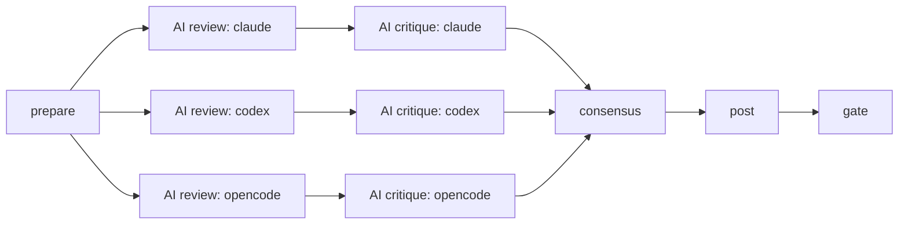
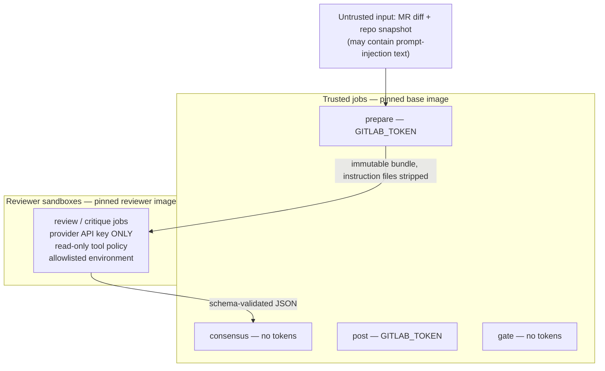

# Architecture Overview

This document explains how Code Tribunal is put together at the level a new
adopter, reviewer, or security auditor needs: which parts are model-controlled,
which are deterministic, where the trust boundaries sit, who holds which
credential, and where decisions are enforced. For the consensus algorithm in
depth, see [CONSENSUS.md](CONSENSUS.md). For behavior
across MR revisions, see [REVISION_LIFECYCLE.md](REVISION_LIFECYCLE.md).

## The one-sentence design

**LLMs propose; deterministic code decides.** Models produce schema-constrained
*candidate findings* and *critique verdicts*. Everything that has consequences —
grouping, voting, severity policy, posting, merge blocking — is plain Python
with reproducible output.

## Pipeline shape

One CI stage (`ai_review`), six phases connected by `needs`/artifacts, on both
GitLab ([ai-review/ci/review.gitlab-ci.yml](../ai-review/ci/review.gitlab-ci.yml))
and GitHub Actions ([ai-review/ci/review.github-actions.yml](../ai-review/ci/review.github-actions.yml)):

| Phase | Runs on | Controlled by | Purpose |
|---|---|---|---|
| `prepare` | trusted base image | deterministic | Build the **immutable input bundle**: diff, read-only repo snapshot, manifest, prior state aliases, effective config. Everything downstream sees exactly this bundle — reviewers cannot observe divergent repository states. |
| `review` ×3 | reviewer image | **model** | Each reviewer CLI (Claude Code, Codex CLI, OpenCode CLI) independently inspects the bundle and must emit findings matching [raw_finding_batch.schema.json](../ai-review/schemas/raw_finding_batch.schema.json). No reviewer sees another reviewer's output. |
| `critique` ×3 | reviewer image | **model** | Each reviewer judges the *pooled, anonymized* findings of its peers (`reviewer_A/B/C` aliases) with verdicts `agree` / `dispute` / `noise` / `duplicate`. |
| `consensus` | trusted base image | deterministic | Canonicalize, group, count votes, apply severity/quorum/critique policy, compute `block_merge`. Byte-reproducible; covered by golden snapshot tests. |
| `post` | trusted base image | deterministic | Upsert MR/PR discussions idempotently; reconcile and persist finding state. |
| `gate` | trusted base image | deterministic | Enforce the verdict: non-zero exit blocks the pipeline (with "Pipelines must succeed" / required checks). |

Review and critique jobs are `allow_failure: true`: an individual model failure
becomes *panel degradation input* for consensus, never a red pipeline by itself.

## Model-controlled vs deterministic operations

| | Model-controlled (probabilistic) | Deterministic (auditable) |
|---|---|---|
| What | Finding text, severity *proposal*, anchor *proposal*, critique verdicts | Anchor normalization & context hashing, grouping, vote counting, severity policy, quorum, degradation, escalation/drop rules, posting, state matching, gate |
| Where | `AI review:`/`AI critique:` jobs via [adapters/](../ai-review/adapters/) | [consensus.py](../ai-review/src/ai_review/consensus.py), [post.py](../ai-review/src/ai_review/post.py), [memory.py](../ai-review/src/ai_review/memory.py), [gate.py](../ai-review/src/ai_review/gate.py) |
| Failure mode | Timeout, provider error, schema violation → recorded `adapter_status`, panel degrades | Bugs are ordinary code bugs; behavior is unit- and golden-tested |
| Trust | Untrusted output; validated per finding against JSON Schema, invalid findings dropped individually | Trusted; ships in the pinned base image |

Two consequences worth internalizing:

- A prompt-injected or hallucinating reviewer can at worst *propose* bad
  findings. It cannot vote twice, cannot set policy, cannot post, and cannot
  block a merge on its own (blocking needs `blocker` severity **and** a
  2-reviewer quorum by default).
- Consensus output is replayable: same artifacts in, byte-identical
  `consensus.json` out.

## Trust boundaries and credentials

- **Credential separation** ([platform/runtime.py](../ai-review/src/ai_review/platform/runtime.py)):
  `GITLAB_TOKEN` provides platform access to trusted jobs but is never passed to reviewer jobs. Reviewer jobs receive a single provider credential; their environment
  is rebuilt from allowlists ([adapter_runner.py](../ai-review/src/ai_review/adapter_runner.py)),
  and the codex/opencode adapters additionally run under `env -i`.
- **Read-only reviewers**: Claude Code runs with `--tools "Read,Grep,Glob"`,
  Codex with `--sandbox read-only`, and OpenCode with a deny-all permission
  config allowing only read/glob/grep. Opt-in Cursor runs with
  `--mode ask --sandbox disabled --trust` and a clean-home permission config
  allowing `Read(**)` while denying `Write(**)`, `Write(/**)`, and `Shell(*)`.
  Cursor's kernel sandbox cannot initialize in nested GitHub Actions job
  containers, so this CLI-policy boundary is a weaker compensating control and
  must be verified against the pinned image before enablement. Repository
  instruction files (`CLAUDE.md`,
  `AGENTS.md`, `.claude/`, `.codex/`, `.opencode/`) are stripped from the
  snapshot before a model sees it — MR content is treated as hostile input.
- **Provider endpoint pinning** is enforced at the adapter validation layer
  (base URLs must match the expected OpenRouter endpoints; model ids are
  format-checked). **Known limitation:** network egress is *not* yet enforced
  at the container/runner layer — a misbehaving CLI could still reach the
  network. Tracked in [SECURITY.md](../SECURITY.md) (H2).
- **Supply chain**: both images are digest-pinned in the CI templates and
  checked by [scripts/check_supply_chain_pins.py](../scripts/check_supply_chain_pins.py);
  GitLab child-pipeline composition is validated by
  [scripts/verify_pipeline_trust.py](../scripts/verify_pipeline_trust.py);
  fork MRs / fork PR dispatches fail closed on both platforms.

## Persistent state

Finding memory lives **on the MR/PR itself**, not in an external store:

- GitLab: a hidden, machine-owned MR note carrying
  `ai-review-state:v1 <base64url JSON> state_hash=<sha256>`; GitHub: a bot PR
  comment. Only notes authored by the authenticated bot account are accepted,
  and the checksum is required ([memory.py](../ai-review/src/ai_review/memory.py)).
- Each record stores the finding's stable `issue_id`, its anchor (path, lines,
  hunk, ±6-line content hash), alias fingerprints, status, and the discussion
  it owns. If the state note is lost, state is recovered from the bot's own
  inline discussion markers.
- See [REVISION_LIFECYCLE.md](REVISION_LIFECYCLE.md) for how records evolve
  across pushes.

## Enforcement point

The **gate job** is the single enforcement point
([gate.py](../ai-review/src/ai_review/gate.py)): it exits non-zero when
consensus decided `block_merge`, and also **fails closed** when posting or
state persistence failed (a review whose results could not be recorded must not
silently pass). With `merge_gate.enabled: false` the whole system runs in
advisory mode — same reviews, same comments, no blocking — which is the
recommended first deployment stage.
