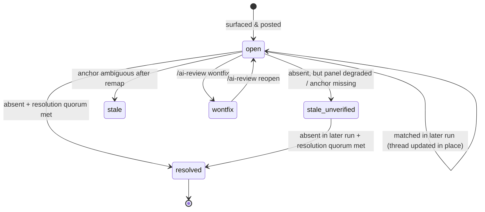

# How Code Tribunal Behaves Across MR Revisions

The hardest part of automated review is not the first review — it is every
review after that. This document explains, with a worked example, how findings
keep their identity when the developer pushes new commits, how discussions are
updated instead of duplicated, and how findings end up `resolved`, `wontfix`,
or `stale`. The implementing code is
[memory.py](../ai-review/src/ai_review/memory.py),
[anchors.py](../ai-review/src/ai_review/anchors.py), and
[post.py](../ai-review/src/ai_review/post.py).

## The problem

A naive AI reviewer re-reviews every push from scratch: it re-posts reworded
versions of yesterday's comments, keeps commenting on lines that moved, and
never notices that an issue was fixed. Code Tribunal treats each finding as a
**stateful object with a stable identity** instead.

## What a finding *is*

After consensus, each finding group has:

- an **`issue_id`** — a deterministic hash of the primary finding's signature;
- an **anchor** — file path, line range, hunk header, and a `context_hash`
  (SHA-256 over the normalized path + the ±6 surrounding diff lines);
- **alias fingerprints** — title fingerprint, evidence fingerprint, source
  finding ids, symbol names — used as fallback matchers;
- a **status** — `open`, `resolved`, `wontfix`, `stale`,
  `stale_unverified`.

All of this is persisted in a machine-owned, checksummed state note on the
MR itself (marker `ai-review-state:v1`; see
[ARCHITECTURE.md](ARCHITECTURE.md#persistent-state)), and every posted
discussion carries an HTML-comment marker with its `issue_id` and a
`body_hash` of the rendered comment.

## Worked example

Suppose revision 1 of an MR adds a list component, and the panel surfaces:

> **AI review: MINOR performance** — `onEndReachedThreshold` of 3 triggers
> cascading prefetch (`SearchList.tsx:89`)

An inline discussion is created; a state record is written:
`issue_id=9e86…, status=open, anchor=SearchList.tsx:89, context_hash=1d9c…`.

### Push 2 — unrelated changes; the flagged line moves

The developer pushes fixes for *other* findings; the list component shifts by
a few lines. On the next run:

1. **Stale-head guard**: if the MR HEAD changed *again* while this pipeline was
   running, posting aborts (`stale_head`) and the gate passes as a no-op — the
   newer pipeline owns the MR. No comments from stale runs.
2. **Anchor remapping** (`remap_anchor`): the record's `context_hash` is
   searched in the *current* diff. Outcomes:
   - `exact` — same place, nothing to do;
   - `remapped` — unique content match at a new location (this also survives
     file renames): the record's anchor is rewritten;
   - `ambiguous` — the same context appears more than once → record marked
     `stale`;
   - `missing` — the context no longer exists → record marked
     `stale_unverified` (see below).
3. **Matching**: each *new* consensus group is matched against stored records
   in a fixed precedence order — exact `issue_id` → `source_finding_id` →
   `context_hash` → title fingerprint + anchor → symbol + title. Exactly one
   match ⇒ the group **inherits the stored `issue_id`** and its existing
   discussion. More than one plausible match ⇒ the group is deliberately
   demoted to FYI rather than guessing (`ambiguous_unassigned`).
   Matching is purely deterministic — no semantic text similarity.
4. **Posting is an upsert**: if the re-rendered comment body has the same
   `body_hash` as what is already on the MR, nothing is written
   (`skipped_unchanged`); if it changed, the **existing** root note is edited
   in place. A second thread is never created for a matched finding.

Net effect in our example: the threshold finding is re-found (possibly by a
*different* reviewer than last time — identity attaches to the issue, not the
model), matched via its fingerprints, and the *original* discussion is
updated.

### Push 3 — the developer fixes the issue

The finding no longer appears in any reviewer's output. It is **not**
immediately declared fixed:

- If at least `panel.min_successful_reviewers_for_resolution` (default 2)
  reviewers completed a trustworthy empty-or-valid review
  (`resolution_eligible_reviewers`) and none re-found it → status `resolved`,
  and the GitLab discussion is resolved by the bot. Batches where every finding
  was dropped as malformed do not count toward that quorum.
- If the panel was degraded below that quorum → `stale_unverified`: the
  absence might just mean the reviewers that would have seen it didn't run.
  A degraded panel cannot "resolve away" your findings.
- A later run with resolution quorum retries records left `stale_unverified`;
  if the finding remains absent, the record and its review thread become
  `resolved`.

If a later revision reintroduces the issue, the record can transition back to
`open` and the same thread is reused.

### Human overrides

Replying **in the finding's thread** with a command (requires developer access
level or above on GitLab, or Write/Maintain/Admin on GitHub):

```
/ai-review wontfix    # durable dismissal — survives future runs
/ai-review reopen     # undo a wontfix / resolution
/ai-review resolve    # mark resolved manually
```

On GitHub, reply directly to the bot's inline review comment in the "Files changed" view.

> **Practical note:** manually resolving the GitLab/GitHub thread (the UI button) is
> *not* the same as `/ai-review wontfix`. A thread-resolve without a command
> does not record a durable disposition — if the code around the finding is
> later refactored so heavily that identity matching fails (new anchor, new
> fingerprints), the panel can legitimately re-raise the same concern as a new
> finding. Use `/ai-review wontfix` for "we considered this, the answer is no."

### When matching gives up: new findings

Identity matching is deliberately conservative. If a refactor rewrites the
code such that neither the content hash nor any alias fingerprint survives,
the old record is closed out (resolved/stale) and the re-detected concern
becomes a **new** finding with a new `issue_id`. You will occasionally see
this as "the bot raised that again" — the alternative (fuzzy matching) would
sometimes silently glue *different* issues together, which is worse for audit
trails.

## State lifecycle summary



## Retention and fail-closed limits

The state note cannot grow unboundedly: retention policy
(`state.retention.*` in [review.yaml](../ai-review/config/review.yaml)) keeps
open/wontfix records plus a bounded history of resolved/stale
records. `keep_resolved_records` and `keep_stale_records` are record counts,
not run windows. The result is also capped by `max_records` and
`max_state_bytes`. If the payload would
still overflow, the post step reports `state_overflow` and the **gate fails
closed** — a review whose memory cannot be persisted does not pass silently.
